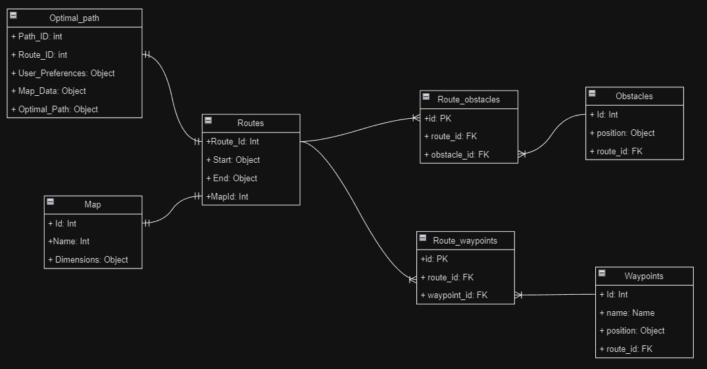
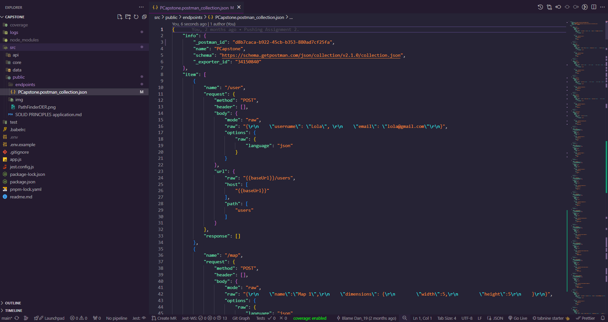

# Capstone Project

### Path Finder
The project seeks the creation of the backend for an application that allows users to find the most optimal route on a map. This backend will fulfill the CRUD functions for the different entities such as maps, routes, users, obstacles... etc. (You can see the DER diagram to review the entities and their relationships). 

The search algorithm implemented for the project was [Dijkstra](https://www.freecodecamp.org/espanol/news/algoritmo-de-la-ruta-mas-corta-de-dijkstra-introduccion-grafica/).

Finally, it is recommended to use Postman as API client for testing the endpoints (more details below). 

## Prerequisites

### Install dependencies
```
npm install
```
### Enviroment variables

THis project depends on some enviroment variables. If you are running locally, create a `.env` file at the root for these variables and check the `.env.example` file to create the enviroment variable. 

## Run the project

```
npm run dev
```
## Unit testing. 
 ```
 npm run test
 ```


## DER 


## Database Set up 

We are using MySql with Sequelize. 
We recommend to setup a localhost connection to run the project. 
As soon as you create the connection, create a database in your DBMS and create a .env to set the configuration (there is a guide in the .env example)
and as soon as you configurate the setup the entities (tables) will be created automatically when you ran the project.

## Postman.

There is a complete Postman Collection for the projet that you can use (located in ./src/public/endpoints):



# Endpoint examples

**Note:** ID's are managed by integer in this case. Project Doesn't support UUID's by the moment (missing requirement). 
### **Users**

- **POST (Body Required):** localhost:5000/api/users 

- **GET (By Id):** localhost:5000/api/users/``{user_id}``

- **PUT (Body Required):** localhost:5000/api/users/``{user_id}``

- **DELETE:** localhost:5000/api/users/``{user_id}``

**Body example:**

```username``` -> String

```email``` -> String

```
{
    "username": "Lola", 
    "email": "lola@gmail.com"
}

```

### Maps

- **POST (Body Required):** localhost:5000/api/maps 

- **GET (By Id):** localhost:5000/api/maps/``{map_id}``

- **PUT (Body Required):** localhost:5000/api/maps/``{map_id}``

- **DELETE:** localhost:5000/api/maps/``{map_id}``

**Body example:**

```name``` -> String

```dimensions``` -> Object: properties-> ```width:integer``` &
```height:integer```
```
{
    "name":"Map 1",
    "dimensions": {
        "width":5,
        "height":5
    }
}
```

### Routes

- **POST (Body Required):** localhost:5000/api/routes 

- **GET (By Id):** localhost:5000/api/routes/``{route_id}``

- **DELETE:** localhost:5000/api/routes/``{route_id}``

**Body example:**

```start``` -> Object: properties->
 ```x:integer``` &
```y:integer```

```end``` -> Object: properties->
 ```x:integer``` &
```y:integer```

```map_id``` -> integer (must be an existent map id)

```
{
    "start": {
        "x": 1,
        "y": 1
    },
    "end":{
        "x": 5,
        "y": 5
    },
    "map_id":1
}
```

### Obstacles

- **POST (Body Required):** localhost:5000/api/obstacles 

- **GET (By Id):** localhost:5000/api/obstacles/``{obstacle_id}``

- **PUT (Body Required):** localhost:5000/api/obstacles/``{obstacle_id}``

- **DELETE:** localhost:5000/api/obstacles/``{obstacle_id}``

**Body example:**

```position``` -> Object: properties->
 ```x:integer``` &
```y:integer```


```route_id``` -> integer (must be an existent route id)

```
{
    "position": {
        "x": 3,
        "y": 3
    },
    "route_id":1
}
```

### Waypoints

- **POST (Body Required):** localhost:5000/api/waypoints

- **GET (By Id):** localhost:5000/api/waypoints/``{waypoint_id}``

- **PUT (Body Required):** localhost:5000/api/waypoints/``{waypoint_id}``

- **DELETE:** localhost:5000/api/waypoints/``{waypoint_id}``

**Body example:**


```name``` -> String

```position``` -> Object: properties->
 ```x:integer``` &
```y:integer```


```route_id``` -> integer (must be an existent route id)

```
{
    "name": "Moms house",
    "position": {
        "x": 3,
        "y": 2
    },
    "route_id":1
}
```

### Optimal Path

- **POST (Body Required):** localhost:5000/api/optimal_path 

- **GET (By Id):** localhost:5000/api/optimal_path/``{optimal_path_id}``

- **DELETE:** localhost:5000/api/optimal_path/``{optimal_path_id}``

**Body example:**


```route_id``` -> integer (must be an existent route id)


```
{
    "route_id":1
}
```

### API Usage Stats

- **GET:** localhost:5000/stats/requests

- **GET:** localhost:5000/stats/response-time

- **GET:** localhost:5000/stats/status-codes

- **GET:** localhost:5000/stats/popular-endpoints
