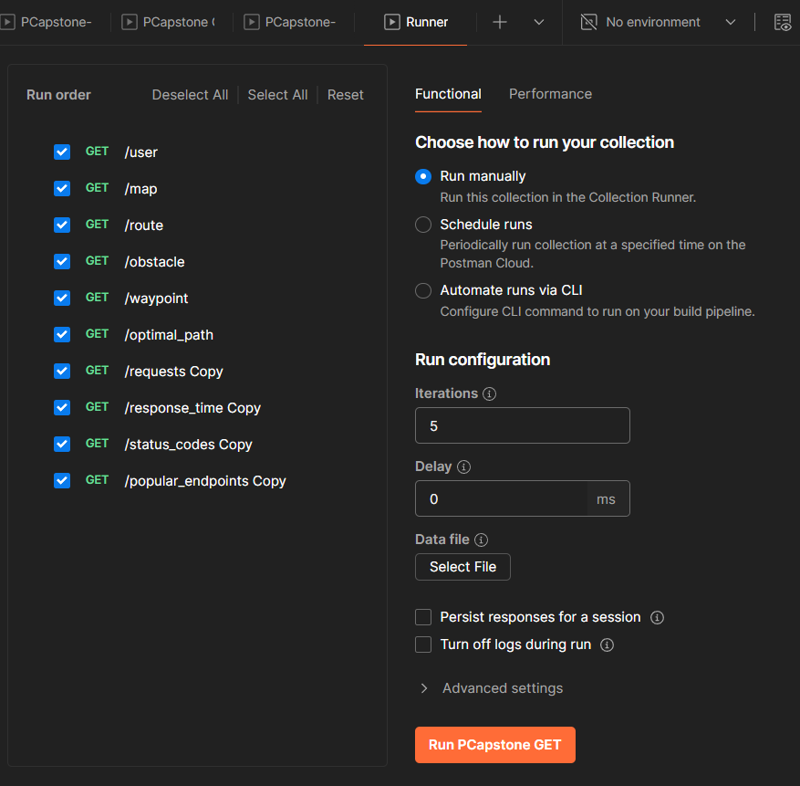
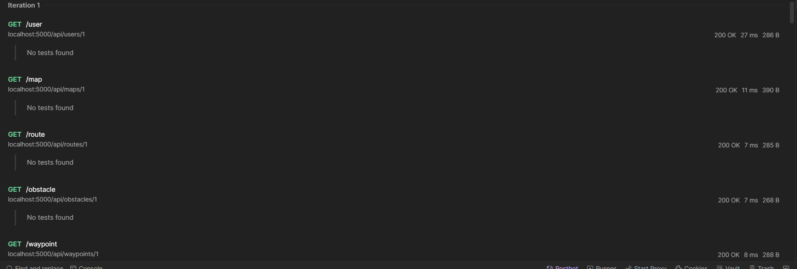
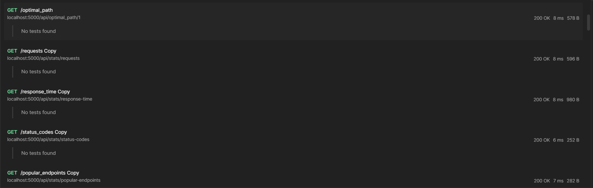
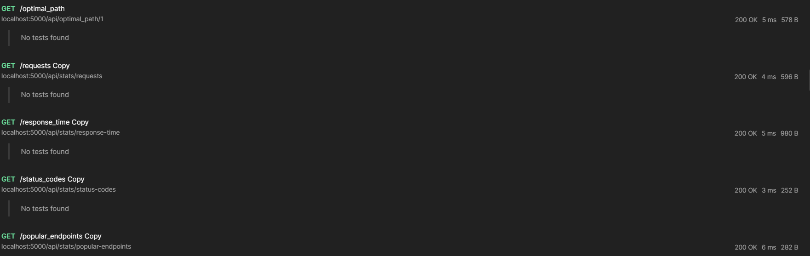
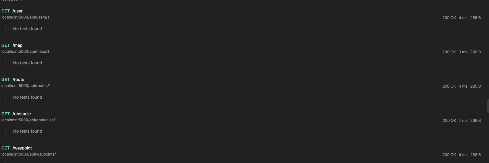
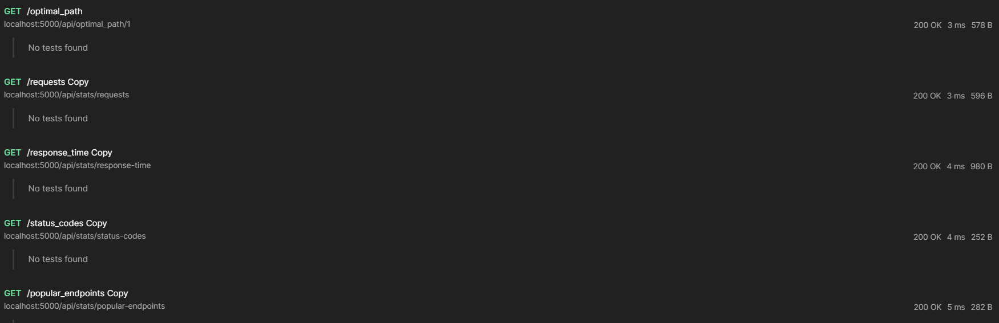

As an evidence of the correct operation of the cache, the next postman collection with the endpoints configured with the cache cache middleware was tested with 5 iterations for each endpoint:

### Results on first iteration:

### Results on second iteration:

### Results on third iteration:

### Results on Fourth iteration:

### Results on Fifth iteration:

As we can se, the memory cache hepls to decrease the response time in most of iteration after the first iteration (which is served with the API).