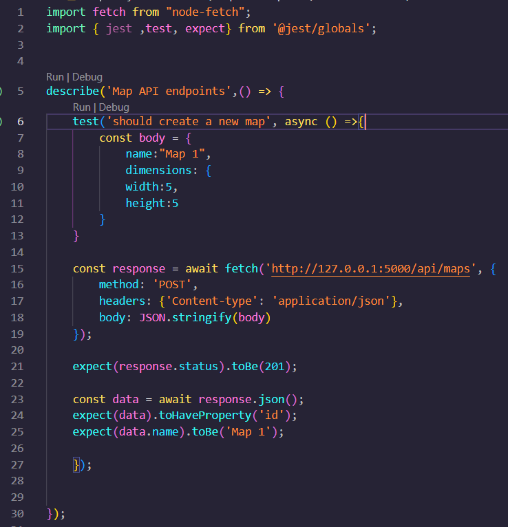

User create a map:

Simulates the basic creation of a map.

User create a route for a map:

Test the steps that users need to follow to create a route for a map:

User create an obstacle for a route:

Aims to verify the flow of the API until create an obstacle for a route:

User create a waypoint for a route:

Aims to verify the flow of the API until create an waypoint for a route:

User create a Optimal Path:

Verify the entire flow of the app to create an Optimal Path:

